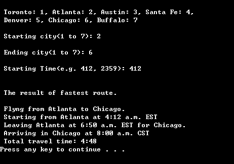

# Airport Routing
> It give airports' information for fastest root to get destination.

### Used Technologies

C#, Visual Studio  

## Description

The user put the start airport, end airport, and start time. The algorithm find fastest root and show the all departure time/ arrival time/ airports name in that root. The time is changed by time zone. 


## Screen Shot

## Installation

Windows:

```sh

```

## Usage example

## Development setup